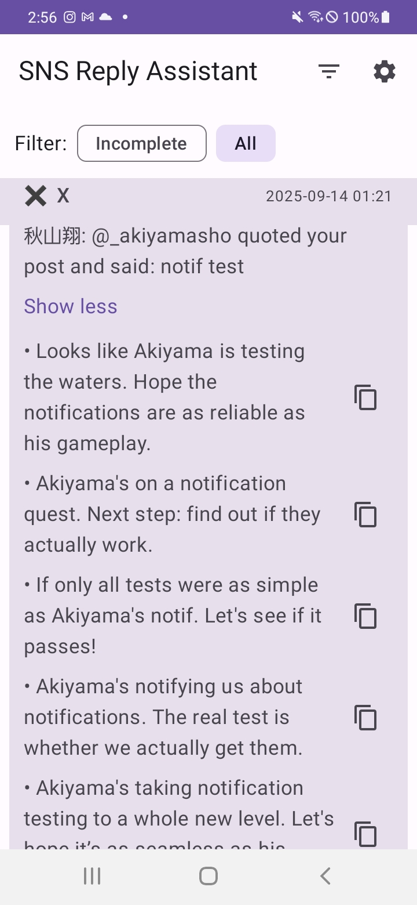

SNS Reply Assistant (Android)

Overview
- A local-first assistant that listens for notifications from LinkedIn, X (Twitter), and Instagram; extracts text + metadata; calls OpenAI GPT-4o to generate 5 suggested replies; stores everything in Room; and shows a simple feed UI with copy-to-clipboard.
- Note that this is for generating reply candidates for inspiration, and it is still the user's responsibility to decide which to post and which parts to edit before actually posting

Key Features
- NotificationListenerService filters packages: LinkedIn (com.linkedin.android), X (com.twitter.android), Instagram (com.instagram.android)
- Extracts title/text/timestamp and parses first URL if present
- Persists posts and replies with Room (PostEntity, ReplyEntity)
- Retrofit/OkHttp client calls OpenAI chat.completions (gpt-4o-mini)
- Platform-specific prompts (professional/witty/casual)
- Jetpack Compose UI feed with expandable posts and copy buttons
- Settings screen to store API key securely via Android Keystore (EncryptedSharedPreferences)
- Simple retry/backoff for API failures

Setup
1) Open in Android Studio (Koala or newer).
2) Run the app on a device (Notification Listener can’t be tested on emulators for third-party apps reliably).
3) In-app, go to Settings and paste your OpenAI API key.
4) Grant Notification Access when prompted or from Settings.
5) Trigger notifications from LinkedIn/X/Instagram on the device; they will appear in the feed with generated replies.

Development Notes
- Model: gpt-4o-mini via /v1/chat/completions
- Replies requested as a JSON array; fallback parsing splits lines if the model returns text.
- Local-only storage; no external backend.
- If generation fails, you can tap Retry on a post card.

Security
- API key stored in EncryptedSharedPreferences protected by Android Keystore.

